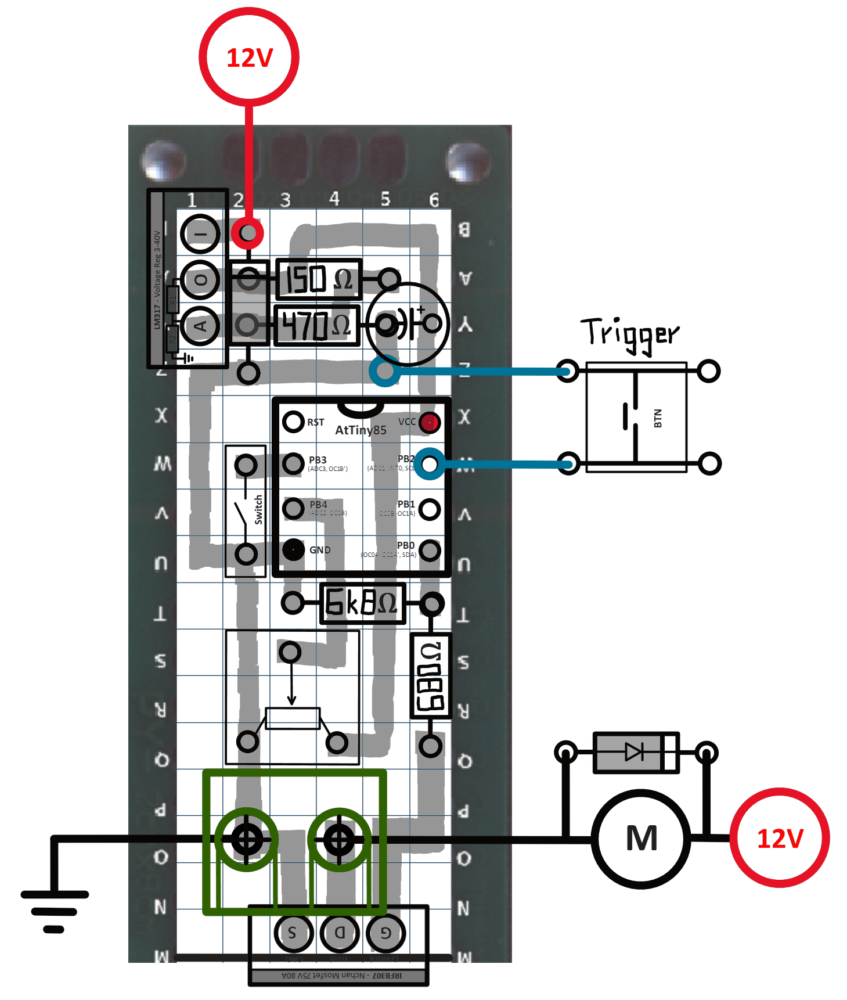

# Airsoft Controller

Control circuit for airsoft AEG. 

## Features
- Mode switch for auto / semi
- Adjustable timings with potentiometer
- Can use precise trigger switch unlike most commercial solutions
- Easy to make functional adjustments in the code

## Technical details
- Based on ATtiny85 MCU
- Mosfet motor control
- Flyback diode to protect circuit from inductive kickback from the motor
- LM317 linear voltage regulator with max input 40V

## Perfboard circuit sketch

